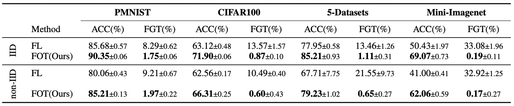

# Federated Orthogonal Training: Mitigating Global Catastrophic Forgetting in Continual Federated Learning

We run the simulation experiment with the FedML packages provided in fedaudio.

## Installation

To setup the environment:
```
conda env create -f fot.yml
conda activate fot
```
You also need to downloads dataset first to run the experiments.

```
cd experiment
python download_datasets.py
```

Our code monitorizes the results in wandb. To enable wandb go to line 396 in experiment/main.py and provide your wandb account's credentials. 

```python
wandb.init(
            mode="disabled",#make enabled after giving correct credentials
            project="FOT",
            entity="your-entity-name",
 
        )
```


## Training and Evaluation
The code provides the evaluation results during the training through wandb. To run the experiments of FOT, use the following commands:

#### Permute-Mnist:
IID Distribution
```
sh run_main.sh 2 5 5  mnist_10ts 10 mlp 125 64 64 0.01 orth 0.96 0.0 0 0 1.0
```

non-IID Distribution
```
sh run_main.sh 2 5 5  mnist_10ts 10 mlp 125 64 64 0.01 orth 0.94 0.0 1 0 1.0 
```

#### Split-Cifar100:

IID Distribution
```
sh run_main.sh 0 8 8  splitCifar100 10 alexnet 50 25 16 0.01 orth 0.87 0.001 0 0 1.0 
```

non-IID Distribution
```
sh run_main.sh 0 8 8  splitCifar100 10 alexnet 50 25 16 0.01 orth 0.87 0.001 1 0 1.0 
```


#### 5-Datasets:

IID Distribution
```
sh run_main.sh 0 8 8  five_datasets 5 resnet 150 64 16 0.01 orth 0.95 0.001 0 0 1.0
```

non-IID Distribution
```
sh run_main.sh 0 8 8  five_datasets 5 resnet 150 64 16 0.01 orth 0.95 0.001 1 0 1.0
```

#### mini-Imagenet:

IID Distribution
```
sh run_main.sh 0 8 8  imagenet 20 resnet_imagenet 50 25 16 0.01 orth 0.90 0.001 0 0 1.0
```

non-IID Distribution
```
sh run_main.sh 0 8 8  imagenet 20 resnet_imagenet 50 25 16 0.01 orth 0.90 0.001 1 0 1.0
```

If you want to try FedAvg instead of FOT just replace **orth** to **normal** in the command.
## Results

**The results should be in the range of standart deviation in the Table 1 below.**

**Table 1: Performance results of different methods on various datasets. ACC (higher is better) stands for average classification accuracy of each task, while FGT (lower is better) denotes average forgetting as. We run each experiment 3 times and provide mean and standard deviation.**




